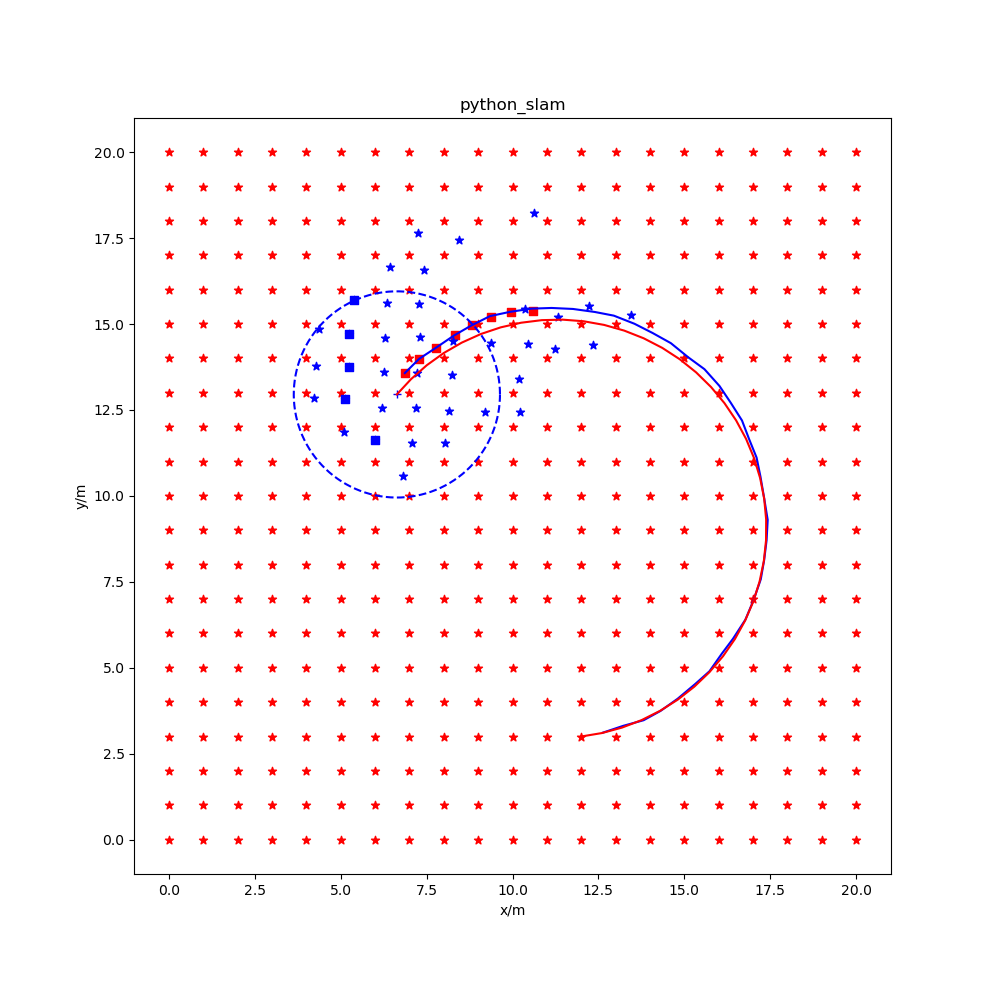

# 2D-SLAM-By-Nonlinear-Optimization

本仓库fork自[liuzhenboo/2D-SLAM-By-Nonlinear-Optimization]

## 待完善内容
- [x] 代码注释
- [x] 数据一致性(测试数据序列化/反序列化)
- [ ] 边缘化策略优化(当边缘化删除了帧所有关联特征点,造成约束浪费) --进行中
- [ ] 位姿误差APE/RPE计算
- [ ] 边缘化过程可视化
- [ ] LM算法优化
- [ ] 其他FEJ策略尝试

## 总结

使用FEJ获取先验的效果：

不使用FEJ获取先验的效果：

由于没有保存先验，所以在前面部分漂移会更快，符合理论

下述内容来自原作者的[2D-SLAM-By-Nonlinear-Optimization](https://github.com/liuzhenboo/2D-SLAM-By-Nonlinear-Optimization) 感谢原作者的分享。
## Features

非线性优化，LM迭代优化，滑动窗口，边缘化，FEJ

## Report

技术文档：
[Reports](./report)

## Reasults

### 只使用前端
注释掉slidewindow_graph.py中函数def Update(self, measure):里的：
    
    self.Optimize_graph()

### 滑动窗口优化（1）

滑窗之外的观测直接舍去，不使用先验信息。
注释掉注释掉slidewindow_graph.py中函数def Optimize_graph(self):里的：

    self.Get_prior()

### 滑动窗口优化（2）

滑窗之外的观测信息不直接舍去，利用舒尔补转换成约束矩阵，形成先验信息，在优化中使用。这里使用的边缘化方案，可以保证FEJ。

